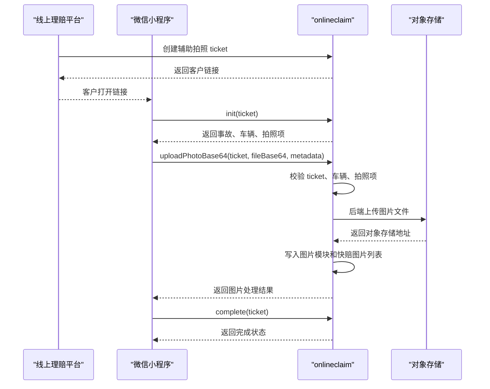

# 辅助拍照微信小程序接口对接文档

| 项目 | 内容 |
| --- | --- |
| 文档版本 | v0.8 |
| 编写日期 | 2026-06-03 |
| 对接范围 | 微信小程序、onlineclaim 服务、对象存储、线上理赔图片模块、快赔图片列表 |
| 适用阶段 | 一期联调接口初稿 |
| 鉴权方案 | ticket 方案 |
| 图片上传方案 | 小程序上传到 onlineclaim，由后端服务处理图片和对象存储 |

## 1. 接口目标

本文档用于微信小程序与线上理赔 onlineclaim 服务进行辅助拍照联调。

一期接口目标：

1. 小程序通过客户链接中的 ticket 初始化案件、车辆和拍照项。
2. 小程序按初始化返回的车辆和拍照项进行拍照。
3. 小程序将图片文件和图片元数据上传到 onlineclaim。
4. onlineclaim 后端服务完成 ticket 校验、车辆和拍照项范围校验、影像目录映射、对象存储上传、图片模块落库，并同步到“进入快赔”对应车辆图片列表。
5. 图片在平台侧展示“辅助拍照”标识。
6. 小程序车辆列表以后端初始化返回为准，辅助拍照链路不允许小程序新增或删除三者车。

二期 VIN 定型和智能定损不阻塞一期小程序联调，完成接口会为二期预留触发点。

## 2. 核心约定

### 2.1 ticket 约定

客户链接只携带 ticket：

```text
https://{wechat-mini-program-entry}?ticket={ticket}
```

小程序打开链接后，从链接参数中解析 ticket。后续初始化、上传、完成接口都必须携带 ticket。

ticket 是辅助拍照任务的临时访问凭证，不是后端登录 token。小程序不能把事故号、车牌号、用户账号作为鉴权依据。

### 2.2 车辆唯一标识

车辆唯一标识使用后端返回的 `vehicleId`：

```text
vehicleId = 车损表ID / 损失车辆ID / 编码后的损失车辆ID
```

小程序只需要原样回传 `vehicleId`。`licenseNo` 仅用于页面展示，不作为小程序上传时的主匹配字段。接口不再返回 `itemNo`。

### 2.3 图片来源标识

通过本链路上传的图片由后端统一标识为：

```text
sourceFlag = AUX_PHOTO
```

小程序不需要传入 `sourceFlag` 或 `sourceName`。平台图片模块展示“辅助拍照”标签时，由后端或前端字典根据 `sourceFlag=AUX_PHOTO` 动态匹配，展示形态参考现有“AI识别”“已回传”等标签。

### 2.4 小程序页面和拍照槽位约定

每辆车固定按以下槽位采集照片：

| 槽位 | 数量限制 | 说明 |
| --- | --- | --- |
| 车牌 | 1 张 | 用于车牌识别或车辆信息核验。 |
| VIN | 1 张 | 用于 VIN 识别或二期车辆定型信息补充。 |
| 车损 | 最多 5 张 | 用于车辆损失查看，并作为二期智能定损图片来源。 |
| 行驶证 | 实物 2 张或电子 1 张 | 实物行驶证分为正页和副页；电子行驶证使用独立上传类型。 |

车辆列表必须以后端初始化接口返回为准。三者车由后端根据案件车辆列表下发，小程序在辅助拍照链路中不允许新增或删除三者车；如果页面存在“添加三者车”“删除此车”按钮，应在本链路隐藏或禁用。

### 2.5 接口返回格式

所有接口建议统一返回：

```json
{
  "success": true,
  "code": "0000",
  "message": "成功",
  "data": {}
}
```

说明：

| 字段 | 类型 | 必填 | 说明 |
| --- | --- | --- | --- |
| `success` | Boolean | 是 | 是否成功。 |
| `code` | String | 是 | 业务响应码，成功为 `0000`。 |
| `message` | String | 是 | 响应描述。 |
| `data` | Object | 否 | 响应数据。 |

如现有 onlineclaim 统一返回结构与本文略有差异，可保持现有结构，但需要保证 `success/message/data` 或等价字段稳定。

### 2.6 公共请求头

| Header | 必填 | 示例 | 说明 |
| --- | --- | --- | --- |
| `Content-Type` | 是 | `application/json;charset=UTF-8` | 小程序接口均使用 JSON 请求；图片上传使用 Base64 JSON。 |
| `X-Client-Type` | 否 | `WECHAT_MINI_PROGRAM` | 客户端类型。 |
| `X-App-Version` | 否 | `1.0.0` | 小程序版本。 |
| `X-Request-Id` | 否 | `uuid` | 请求追踪号，便于排查问题。 |

## 3. 调用流程



图片上传方式已确认：小程序不直传对象存储，也不需要获取对象存储上传凭证。小程序将本地图片读取为 Base64 后以 JSON 上传到 onlineclaim，由后端服务统一处理对象存储、图片模块落库和快赔图片列表同步。

## 4. 接口清单

| 序号 | 接口 | 调用方 | 说明 |
| --- | --- | --- | --- |
| 1 | `POST /onlineclaim/AuxPhotoService/createLink` | 线上理赔平台 | 生成辅助拍照 ticket 链接，小程序不调用。 |
| 2 | `POST /onlineclaim/AuxPhotoService/init` | 小程序 | 根据 ticket 初始化案件、车辆、拍照项。 |
| 3 | `POST /onlineclaim/AuxPhotoService/uploadPhotoBase64` | 小程序 | 将图片 Base64 和元数据上传到 onlineclaim，由后端处理图片。 |
| 4 | `POST /onlineclaim/AuxPhotoService/complete` | 小程序 | 标记本次辅助拍照完成。 |
| 5 | `POST /onlineclaim/AuxPhotoService/queryTaskStatus` | 线上理赔平台 | 查询客户打开、上传、完成、二期处理状态；小程序一期不必接入。 |

### 4.1 开发期前端联调 baseUrl

小程序端辅助拍照接口基础地址由 `env-config` 统一管理，环境策略主口径见 `docs/env-config-design.md`。

开发期可启动本地 mock 后端：

```powershell
npm run mock:aux-photo
```

然后在微信开发者工具中设置本地接口地址：

```javascript
wx.setStorageSync('SELF_CAM_AUX_PHOTO_HOST', 'http://127.0.0.1:8787')
```

该配置仅用于 `develop` 环境联调。`trial/release` 不依赖本地缓存覆盖，直接使用 `env-config` 中的内置体验版/正式版后端地址。

## 5. 平台生成链接接口

该接口由线上理赔平台查勘/定损页面调用，小程序不直接调用。

```http
POST /onlineclaim/AuxPhotoService/createLink
```

### 5.1 请求参数

```json
{
  "registNo": "R202605200001",
  "vehicleScope": "ALL",
  "expireHours": 24
}
```

| 字段 | 类型 | 必填 | 说明 |
| --- | --- | --- | --- |
| `registNo` | String | 是 | 事故号/报案号。 |
| `vehicleScope` | String | 否 | 车辆范围，默认 `ALL`。 |
| `expireHours` | Number | 否 | 链接有效小时数，默认 24 小时，最终按业务配置。 |

### 5.2 响应参数

```json
{
  "success": true,
  "code": "0000",
  "message": "生成成功",
  "data": {
    "ticket": "AUX202605200001abcdef",
    "url": "https://example.com/miniapp?ticket=AUX202605200001abcdef",
    "expireTime": "2026-05-21 10:00:00",
    "status": "CREATED"
  }
}
```

## 6. 小程序初始化接口

小程序打开客户链接后，第一步调用初始化接口。

```http
POST /onlineclaim/AuxPhotoService/init
```

### 6.1 请求参数

```json
{
  "ticket": "AUX202605200001abcdef",
  "openId": "wechat-open-id",
  "clientVersion": "1.0.0"
}
```

| 字段 | 类型 | 必填 | 说明 |
| --- | --- | --- | --- |
| `ticket` | String | 是 | 客户链接中的 ticket。 |
| `openId` | String | 否 | 微信 openId；一期可选，后续可用于首次打开绑定。 |
| `clientVersion` | String | 否 | 小程序版本。 |

### 6.2 响应参数

```json
{
  "success": true,
  "code": "0000",
  "message": "初始化成功",
  "data": {
    "ticket": "AUX202605200001abcdef",
    "ticketStatus": "OPENED",
    "registNo": "R202605200001",
    "expireTime": "2026-05-21 10:00:00",
    "vehicles": [
      {
        "vehicleId": "LOSS_VEHICLE_100001",
        "vehicleRole": "INSURED",
        "vehicleRoleName": "标的车",
        "licenseNo": "京A12345",
        "uploadItems": [
          {
            "uploadItemId": "LOSS_VEHICLE_100001_LICENSE_PLATE",
            "photoType": "LICENSE_PLATE",
            "photoName": "车牌",
            "required": false,
            "maxCount": 1,
            "uploadedCount": 0
          },
          {
            "uploadItemId": "LOSS_VEHICLE_100001_VIN",
            "photoType": "VIN",
            "photoName": "VIN",
            "required": false,
            "maxCount": 1,
            "uploadedCount": 0
          },
          {
            "uploadItemId": "LOSS_VEHICLE_100001_DAMAGE",
            "photoType": "DAMAGE",
            "photoName": "车损",
            "required": true,
            "maxCount": 5,
            "uploadedCount": 0
          },
          {
            "uploadItemId": "LOSS_VEHICLE_100001_DRIVING_LICENSE_FRONT",
            "photoType": "DRIVING_LICENSE_FRONT",
            "photoName": "行驶证正页",
            "required": false,
            "maxCount": 1,
            "uploadedCount": 0
          },
          {
            "uploadItemId": "LOSS_VEHICLE_100001_DRIVING_LICENSE_BACK",
            "photoType": "DRIVING_LICENSE_BACK",
            "photoName": "行驶证副页",
            "required": false,
            "maxCount": 1,
            "uploadedCount": 0
          },
          {
            "uploadItemId": "LOSS_VEHICLE_100001_DRIVING_LICENSE_ELECTRONIC",
            "photoType": "DRIVING_LICENSE_ELECTRONIC",
            "photoName": "电子行驶证",
            "required": false,
            "maxCount": 1,
            "uploadedCount": 0
          }
        ]
      },
      {
        "vehicleId": "LOSS_VEHICLE_100002",
        "vehicleRole": "THIRD_PARTY",
        "vehicleRoleName": "三者车",
        "licenseNo": "京B12345",
        "uploadItems": [
          {
            "uploadItemId": "LOSS_VEHICLE_100002_LICENSE_PLATE",
            "photoType": "LICENSE_PLATE",
            "photoName": "车牌",
            "required": false,
            "maxCount": 1,
            "uploadedCount": 0
          },
          {
            "uploadItemId": "LOSS_VEHICLE_100002_VIN",
            "photoType": "VIN",
            "photoName": "VIN",
            "required": false,
            "maxCount": 1,
            "uploadedCount": 0
          },
          {
            "uploadItemId": "LOSS_VEHICLE_100002_DAMAGE",
            "photoType": "DAMAGE",
            "photoName": "车损",
            "required": true,
            "maxCount": 5,
            "uploadedCount": 0
          },
          {
            "uploadItemId": "LOSS_VEHICLE_100002_DRIVING_LICENSE_FRONT",
            "photoType": "DRIVING_LICENSE_FRONT",
            "photoName": "行驶证正页",
            "required": false,
            "maxCount": 1,
            "uploadedCount": 0
          },
          {
            "uploadItemId": "LOSS_VEHICLE_100002_DRIVING_LICENSE_BACK",
            "photoType": "DRIVING_LICENSE_BACK",
            "photoName": "行驶证副页",
            "required": false,
            "maxCount": 1,
            "uploadedCount": 0
          },
          {
            "uploadItemId": "LOSS_VEHICLE_100002_DRIVING_LICENSE_ELECTRONIC",
            "photoType": "DRIVING_LICENSE_ELECTRONIC",
            "photoName": "电子行驶证",
            "required": false,
            "maxCount": 1,
            "uploadedCount": 0
          }
        ]
      }
    ]
  }
}
```

初始化响应采用 `vehicles[] -> uploadItems[]` 结构。小程序直接按“车辆 -> 拍照项”渲染页面，不需要感知影像目录编码、文件夹编码或对象存储路径。

小程序应按初始化返回的 `maxCount` 渲染槽位：车牌和 VIN 各 1 个槽位，车损按 `maxCount=5` 渲染为车损 1 至车损 5，行驶证按正页、副页分别渲染。车辆列表只读展示，三者车不得由小程序新增或删除。

### 6.3 响应字段说明

| 字段 | 类型 | 说明 |
| --- | --- | --- |
| `ticket` | String | 当前辅助拍照 ticket。 |
| `ticketStatus` | String | ticket 状态，见枚举说明。 |
| `registNo` | String | 事故号/报案号。 |
| `expireTime` | String | ticket 过期时间。 |
| `vehicles` | Array | 车辆列表。 |
| `vehicles[].vehicleId` | String | 车辆唯一标识，建议使用车损表 ID、损失车辆 ID 或其编码值。 |
| `vehicles[].vehicleRole` | String | 车辆角色，`INSURED` 标的车，`THIRD_PARTY` 三者车。 |
| `vehicles[].vehicleRoleName` | String | 车辆角色中文名称，例如“标的车”“三者车”。 |
| `vehicles[].licenseNo` | String | 车牌号，仅用于页面展示。 |
| `vehicles[].uploadItems` | Array | 当前车辆下的拍照项。 |
| `vehicles[].uploadItems[].uploadItemId` | String | 上传项唯一标识，小程序上传时原样回传。 |
| `vehicles[].uploadItems[].photoType` | String | 拍照类型，见枚举说明。 |
| `vehicles[].uploadItems[].photoName` | String | 拍照项展示名称。 |
| `vehicles[].uploadItems[].required` | Boolean | 是否必拍。 |
| `vehicles[].uploadItems[].maxCount` | Number | 最大上传张数。 |
| `vehicles[].uploadItems[].uploadedCount` | Number | 已上传张数。 |

精简约定：小程序初始化响应只保留 `registNo` 作为事故号/报案号唯一标识，不返回 `accidentNo`。车辆字段只返回拍照和上传所需字段，`vin`、`vehicleName`、`engineNo`、`ownerName` 不作为小程序接口字段返回，后端如有需要可内部保留。影像目录字段 `parentTypeCode/typeCode/uCode/uType` 也不返回给小程序。

### 6.4 图片类型与后端影像目录映射

小程序只使用 `photoType`，不接收、不回传影像目录字段。后端根据 `vehicleRole + photoType` 映射真实影像目录字段。

影像目录字段参照《车险理赔照片分类清单.xlsx》获取：

| photoType | 标的车映射 | 三者车映射 | maxCount | 说明 |
| --- | --- | --- | --- | --- |
| `LICENSE_PLATE` | `02/0202/1201/CRPHTO` | `02/0203/1201/CRPHTO` | 1 | 车牌照片。 |
| `VIN` | `02/0202/1201/CRPHTO` | `02/0203/1201/CRPHTO` | 1 | VIN 照片。 |
| `DAMAGE` | `02/0202/1201/CRPHTO` | `02/0203/1201/CRPHTO` | 5 | 车损照片。 |
| `DRIVING_LICENSE_FRONT` | `0301/030105/CRPHTO_03/CRPHTO` | `0302/030205/CRPHTO_03/CRPHTO` | 1 | 行驶证正页。 |
| `DRIVING_LICENSE_BACK` | `0301/030106/CRPHTO_03/CRPHTO` | `0302/030206/CRPHTO_03/CRPHTO` | 1 | 行驶证副页。 |
| `DRIVING_LICENSE_ELECTRONIC` | 后端按电子行驶证配置映射 | 后端按电子行驶证配置映射 | 1 | 电子行驶证。小程序只回传初始化下发的 `uploadItemId` 和该 `photoType`。 |

说明：映射格式为 `parentTypeCode/typeCode/uCode/uType`，仅用于后端落库。照片分类清单中没有单独的 VIN 目录，VIN 照片按车辆角色落入 `0202/0203`，通过 `photoType=VIN` 区分用途。

## 7. 图片上传处理接口

小程序拍照后，直接将图片 Base64 和图片元数据上传到 onlineclaim。后端服务负责：

1. 校验 ticket 是否有效。
2. 校验车辆和拍照项是否属于初始化接口返回范围。
3. 校验文件类型、大小、数量限制和重复上传。
4. 将图片文件上传到对象存储。
5. 写入图片模块元数据，并同步到快赔图片列表。
6. 返回图片处理结果。

```http
POST /onlineclaim/AuxPhotoService/uploadPhotoBase64
```

### 7.1 请求方式

```http
Content-Type: application/json;charset=UTF-8
```

一期上传接口按“单张图片一个请求”设计。小程序可以一次选择或拍摄多张图片，但需要在前端按队列逐张调用 `uploadPhotoBase64`；全部上传完成后再调用 `complete`。

请求字段：

| 字段 | 类型 | 必填 | 说明 |
| --- | --- | --- | --- |
| `ticket` | String | 是 | 辅助拍照 ticket。 |
| `clientPhotoId` | String | 强烈建议 | 小程序本地照片唯一 ID，用于幂等。 |
| `uploadItemId` | String | 是 | 初始化接口返回的上传项 ID。 |
| `vehicleId` | String | 是 | 车辆唯一标识。 |
| `photoType` | String | 是 | 拍照类型，必须与初始化接口返回的拍照项一致。 |
| `fileName` | String | 否 | 文件名，用于判断后缀；不传时后端按 Base64 前缀推断。 |
| `fileBase64` | String | 是 | 图片 Base64 字符串，支持纯 Base64，也支持 `data:image/jpeg;base64,` 前缀。 |
| `base64` | String | 否 | `fileBase64` 的兼容字段；两个都传时优先使用 `fileBase64`。 |
| `fileHash` | String | 否 | 文件哈希，用于重复上传判断；不传时后端按文件内容计算。 |
| `shootTime` | String | 否 | 拍摄时间，建议格式 `yyyy-MM-dd HH:mm:ss`。 |
| `sortNo` | Number | 否 | 同一上传项下的排序。车损照片建议使用 `1..5`；车牌、VIN、行驶证正页、行驶证副页固定为 `1`。 |

### 7.2 请求示例

```json
{
  "ticket": "AUX202605200001abcdef",
  "vehicleId": "LOSS_VEHICLE_100001",
  "uploadItemId": "LOSS_VEHICLE_100001_DAMAGE",
  "photoType": "DAMAGE",
  "clientPhotoId": "mini-local-uuid-001",
  "sortNo": 1,
  "shootTime": "2026-05-20 10:12:30",
  "fileName": "damage_001.jpg",
  "fileBase64": "/9j/4AAQSkZJRgABAQ..."
}
```

小程序上传示意：

```javascript
wx.getFileSystemManager().readFile({
  filePath: localFilePath,
  encoding: 'base64',
  success(res) {
    wx.request({
      url: `${baseUrl}/onlineclaim/AuxPhotoService/uploadPhotoBase64`,
      method: 'POST',
      header: {
        'content-type': 'application/json'
      },
      data: {
        ticket,
        vehicleId,
        uploadItemId,
        photoType,
        clientPhotoId,
        sortNo,
        fileName,
        fileBase64: res.data
      }
    })
  }
})
```

### 7.3 响应参数

```json
{
  "success": true,
  "code": "0000",
  "message": "图片上传成功",
  "data": {
    "uploadRecordId": "AUP202605200001",
    "photoId": "DOC202605200001",
    "vehicleId": "LOSS_VEHICLE_100001",
    "uploadItemId": "LOSS_VEHICLE_100001_DAMAGE",
    "photoType": "DAMAGE",
    "duplicate": false,
    "itemUploadedCount": 1,
    "ticketStatus": "UPLOADING"
  }
}
```

说明：

1. 如果后端判断为重复上传，可以返回 `success=true` 且 `duplicate=true`，小程序按成功处理。
2. 后端会根据 `ticket + vehicleId + uploadItemId + clientPhotoId/fileHash` 做幂等控制。
3. 后端必须校验该图片是否属于 ticket 初始化返回的车辆和拍照项。
4. 上传响应不返回真实 `objectKey`、`fileServerAddr`。如需服务端图片预览，应通过后端代理预览接口或短期签名 URL 实现。
5. 后端必须校验上传数量不能超过初始化返回的 `maxCount`，例如同一车辆车损最多 5 张、车牌/VIN/行驶证正副页各 1 张。

## 8. 完成接口

客户完成本次拍照后，小程序调用完成接口。

```http
POST /onlineclaim/AuxPhotoService/complete
```

### 8.1 请求参数

```json
{
  "ticket": "AUX202605200001abcdef",
  "openId": "wechat-open-id",
  "clientUploadCount": 9,
  "remark": ""
}
```

| 字段 | 类型 | 必填 | 说明 |
| --- | --- | --- | --- |
| `ticket` | String | 是 | 辅助拍照 ticket。 |
| `openId` | String | 否 | 微信 openId。 |
| `clientUploadCount` | Number | 否 | 小程序侧统计的上传张数。 |
| `remark` | String | 否 | 备注。 |

### 8.2 响应参数

```json
{
  "success": true,
  "code": "0000",
  "message": "辅助拍照已完成",
  "data": {
    "ticket": "AUX202605200001abcdef",
    "ticketStatus": "COMPLETED",
    "uploadedCount": 9,
    "requiredPassed": true,
    "missingItems": [],
    "completeTime": "2026-05-20 10:30:00",
    "phase2TriggerStatus": "NOT_ENABLED"
  }
}
```

说明：

| 字段 | 说明 |
| --- | --- |
| `requiredPassed` | 必拍项是否已满足。 |
| `missingItems` | 未满足的必拍项。 |
| `phase2TriggerStatus` | 二期预留字段，如 `NOT_ENABLED`、`PENDING`、`PROCESSING`。 |

## 9. 平台侧状态查询接口

小程序一期主流程不依赖独立状态查询接口。用户从首页点击 `开始采集` 且存在 `ticket` 时，前端先重新调用 `init`，由 `init` 返回 `ticketStatus` 和各拍照项 `uploadedCount` 决定后续流程。

前端优先读取 `data.ticketStatus`，兼容 `data.status`，并在 trim 后转大写判断。`COMPLETED / EXPIRED / REVOKED` 只展示轻提示并停留首页，不申请相机权限、不进入拍照页、不恢复本地缓存。预览页上传重试、完成重试不新增 `init` 调用，只基于本地 `cache.auxPhoto.ticketStatus` 做防御拦截。

查勘/定损平台如需查看客户是否打开、是否上传、是否完成、二期是否处理完成，可单独保留平台侧查询接口：

```http
POST /onlineclaim/AuxPhotoService/queryTaskStatus
```

该接口不作为小程序必接接口，具体字段可按平台页面展示需要单独定义。

## 10. 枚举定义

### 10.1 ticket 状态

| 值 | 说明 |
| --- | --- |
| `CREATED` | 已生成，客户尚未打开。 |
| `OPENED` | 客户已打开并初始化成功。 |
| `UPLOADING` | 已上传部分图片。 |
| `COMPLETED` | 客户已完成辅助拍照。 |
| `EXPIRED` | 链接已过期。 |
| `REVOKED` | 链接已作废。 |
| `FAILED` | 处理失败。 |

### 10.2 车辆角色

| 值 | 说明 |
| --- | --- |
| `INSURED` | 标的车。 |
| `THIRD_PARTY` | 三者车。 |

### 10.3 拍照类型

| 值 | 说明 | maxCount |
| --- | --- | --- |
| `LICENSE_PLATE` | 车牌照片。 | 1 |
| `VIN` | VIN 照片。 | 1 |
| `DAMAGE` | 车损照片。 | 5 |
| `DRIVING_LICENSE_FRONT` | 行驶证正页。 | 1 |
| `DRIVING_LICENSE_BACK` | 行驶证副页。 | 1 |
| `DRIVING_LICENSE_ELECTRONIC` | 电子行驶证。 | 1 |

## 11. 错误码

| code | message | 小程序处理建议 |
| --- | --- | --- |
| `0000` | 成功 | 正常处理。 |
| `AUX_PARAM_INVALID` | 参数不合法 | 提示用户重试；开发联调时检查请求字段。 |
| `AUX_TICKET_NOT_FOUND` | 链接不存在 | 提示链接无效，联系查勘员重新发送。 |
| `AUX_TICKET_EXPIRED` | 链接已过期 | 提示链接已过期，联系查勘员重新生成。 |
| `AUX_TICKET_REVOKED` | 链接已作废 | 提示链接已失效。 |
| `AUX_TICKET_COMPLETED` | 辅助拍照已完成 | 提示照片已完成采集，不再进入拍照、预览或完成页。 |
| `AUX_CASE_CLOSED` | 案件不可操作 | 提示案件状态已变化。 |
| `AUX_VEHICLE_NOT_ALLOWED` | 车辆不在本次拍照范围 | 停止上传并提示。 |
| `AUX_PHOTO_TYPE_NOT_ALLOWED` | 拍照项不在本次拍照范围 | 停止上传并提示。 |
| `AUX_UPLOAD_DUPLICATE` | 图片已上传 | 按成功处理或刷新状态。 |
| `AUX_UPLOAD_FAILED` | 图片上传处理失败 | 支持重试。 |
| `AUX_SERVER_ERROR` | 系统异常 | 提示稍后重试。 |

错误响应示例：

```json
{
  "success": false,
  "code": "AUX_TICKET_EXPIRED",
  "message": "链接已过期，请联系查勘员重新发送",
  "data": {
    "ticketStatus": "EXPIRED"
  }
}
```

## 12. 小程序开发注意事项

1. 小程序只从链接解析 ticket，不需要解析事故号、车牌号、车辆列表等业务数据。
2. 每次接口调用都需要携带 ticket。
3. 上传图片时必须使用初始化接口返回的 `uploadItemId`、`vehicleId`、`photoType`。
4. `clientPhotoId` 建议由小程序为每张本地照片生成 UUID，重试时保持不变，便于后端幂等。
5. 图片上传接口返回 `duplicate=true` 时，小程序按上传成功处理。
6. 链接已完成、过期、作废、案件关闭时，小程序应阻止继续拍照和上传。
7. 如果客户中途退出后再次打开链接，小程序应在首页开始采集时重新调用 `init`；非拦截状态才恢复可用缓存或按 `init` 数据重建缓存。
8. 二期智能定损不影响一期上传闭环，小程序一期只需要展示上传完成状态。
9. 辅助拍照链路中车辆列表只读，三者车只能以后端返回为准，小程序不得新增或删除三者车。
10. 图片上传一张一个请求；车损照片最多 5 张，上传时用 `sortNo=1..5` 标识顺序。
11. 行驶证正页、副页、电子行驶证是三个独立 `uploadItemId`，不要用一个行驶证上传项承载多张图或多种类型。

## 13. 待联调确认项

| 编号 | 待确认项 | 说明 |
| --- | --- | --- |
| T-001 | 小程序入口参数名 | 当前文档按 `ticket` 设计，如微信 URL Link/URL Scheme 使用 `scene`，需约定 ticket 编码和解析方式。 |
| T-002 | 后端图片处理实现 | 上传方式已确认由小程序上传到 onlineclaim；后端需要确认文件大小限制、压缩策略、对象存储路径生成规则和失败重试策略。 |
| T-003 | 影像目录编码 | 已按《车险理赔照片分类清单.xlsx》补充本次一期目录编码；后端实现时需确认线上字典与清单一致。 |
| T-004 | 链接有效期 | 文档暂按默认 24 小时设计，最终以业务配置为准。 |
| T-005 | 车辆主键字段 | 需要确认车损表 ID 的准确字段名，是 `lossId`、`qpLossId`、`lossVehicleId`，还是其他主键；如不允许直接返回数据库主键，需要确认编码规则。 |
| T-006 | 图片预览方式 | 小程序重新进入页面后如需展示已上传缩略图，需要确认使用后端代理预览还是短期签名 URL。 |
| T-007 | 行驶证未上传是否阻断完成 | 当前小程序截图表现为提醒“可能影响后续处理”，是否阻止完成采集需业务确认。 |
